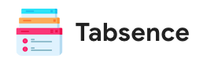
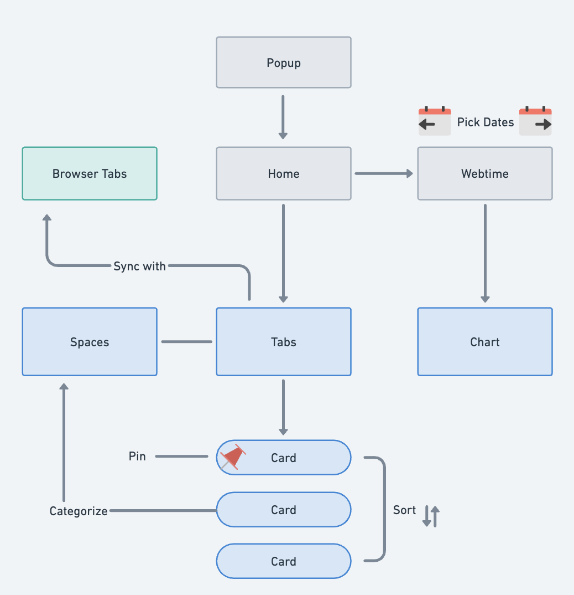
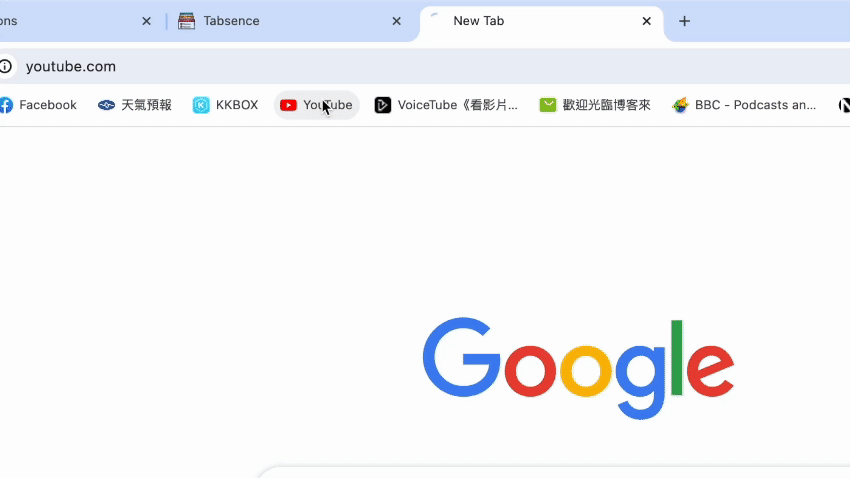
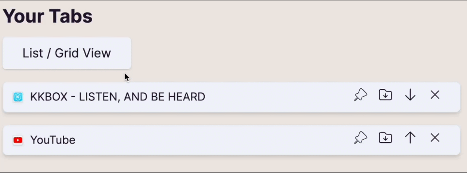
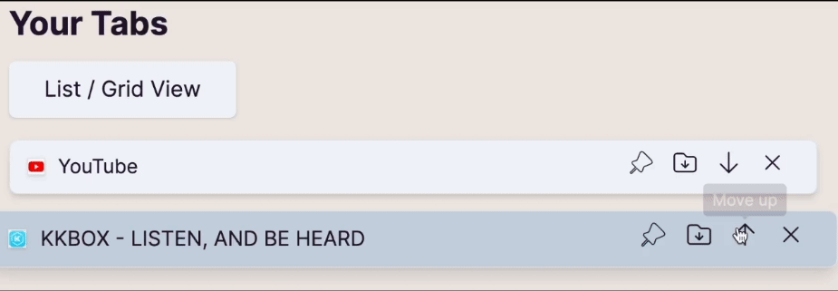
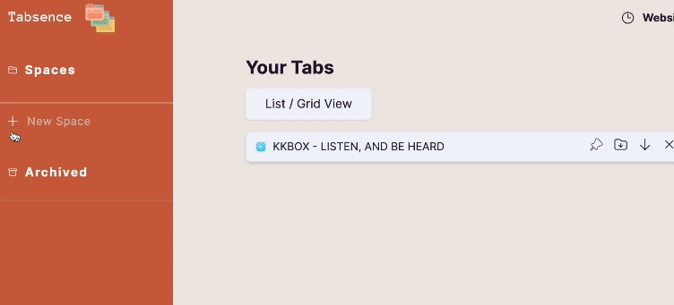
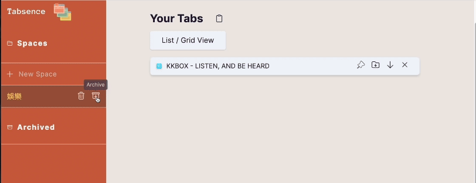
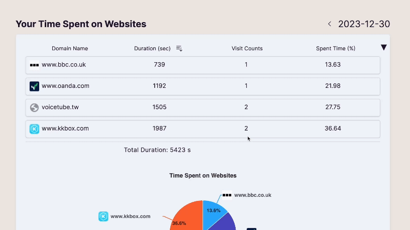

  
  

   =_18.2.0-blue" alt="react"/>
   =_8.45.0-blue" alt="react"/>
  

   <a href="#about-tabsence">About</a>
   | 
   <a href="#demo">Demo</a>
   | 
   <a href="#contact">Contact</a>
  

# Tabsence

[Tabsence](https://chromewebstore.google.com/detail/tabsence/icdbgchingbnboklhnagfckgjpdfjfeg?hl=zh-TW) is a Chrome extension that organizes users’ browser tabs and boosts their productivity by tracking time spent on websites.

## About Tabsence

- Delivered an organized Internet experience, allowing users to sort and categorize tabs into spaces, powered by `Chrome Extension API`.
- Synchronized browser tabs on the extension page by `onSnapshot` of Cloud FireStore.
- Optimized user experience by persisting the tabs and the spaces on the website with `Cloud Firestore` and `Chrome storage`.
- Tracked users' time spent on different websites, and visualized the data on the webpage using `Highcharts`.
- Implemented global state management with `Zustand`.

## Built with

    
   
   
   
   
   
   

Base

- React / Vite
- Zustand
- Firebase
- Tailwind
- ESLint
- TypeScript

Libraries

- react-hot-toast
- highcharts
- daisyui
- date-fns

## Flow chart

   

## Demo

- Sorting and categorization of tabs can be done on the homepage:

1. Opened Tabs in the browser will be rendered on the extension page at the same time.

   

2. Tabs can be viewed in list or grid views.

   

3. Tabs can be sorted on the extension page by clicking arrows on the tab card.

   

4. Tabs can be categorized into customized spaces users create.

   

- Unused spaces can be archived and can be restored later.

   

- The time spent on websites is visualized by a table and a chart on the webtime page. Data is displayed per day, and switching dates can be done by clicking the arrows on the top-right corner.

   

## Contact

   
   

